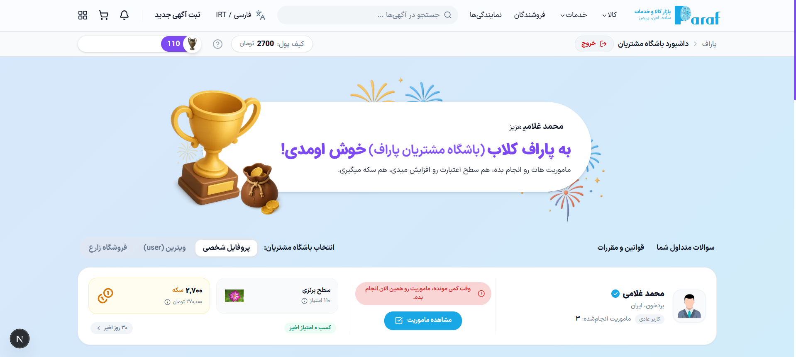

# داشبورد باشگاه مشتریان پاراف

🇬🇧 [English Version](README.md)



یک داشبورد مشتریان مبتنی بر Next.js 16 که با React 19، TypeScript، Tailwind CSS v4، React Query، Zustand، React Hook Form و Zod ساخته شده است.

## تکنولوژی‌ها

- Next.js 16
- React 19
- TypeScript
- Tailwind CSS v4
- Shadcn/UI
- Radix UI
- TanStack Query
- Zustand
- React Hook Form
- Zod
- Axios
- Lucide React

## قابلیت‌های اصلی

- جریان ورود با فرم لاگین و ذخیره توکن
- داشبورد خلاصه شامل کیف پول، سطح و فعالیت‌ها
- جابه‌جایی بین profile و vitrin
- UI ریسپانسیو با banner و hero section سفارشی
- اعتبارسنجی فرم با Zod و React Hook Form
- دریافت داده‌ها از API با React Query

## معماری پروژه

این پروژه روی Next.js App Router و ساختار Feature-First ساخته شده است:

- `src/app` شامل layout اصلی، providerها و gate صفحه است
- `src/features/auth` شامل UI ورود، schema، API و auth store است
- `src/features/dashboard` شامل sectionها، hookها و سرویس‌های داشبورد است
- `src/features/vitrin` شامل state مربوط به context فعال است
- `src/shared` شامل API client، typeها و shellهای مشترک است

Stateهای کلاینت با Zustand مدیریت می‌شوند، server state با React Query، و فرم‌ها با React Hook Form + Zod.

## شروع سریع

```bash
pnpm install
pnpm dev
```

## ساخت

```bash
pnpm build
```

## اجرا

```bash
pnpm start
```

## مستندات

- [معماری](./docs/architecture.md)
- [راه‌اندازی](./docs/setup.md)
- [احراز هویت](./docs/auth.md)
- [داشبورد](./docs/dashboard.md)
- [ویترین](./docs/vitrin.md)
